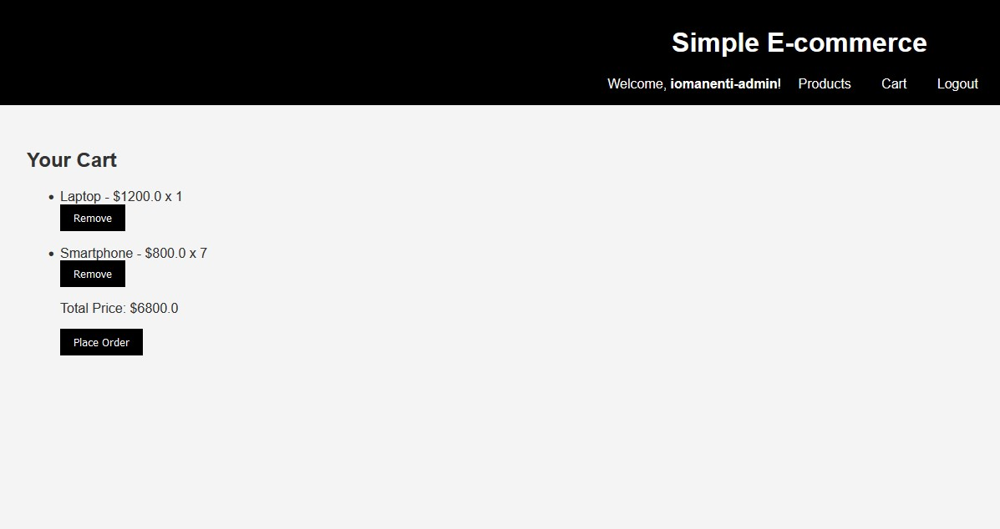

Simple E-commerce with Microservices
=====================================
 

The project is divided into multiple microservices, each handling specific responsibilities (e.g., user management, product management, cart, and orders). A simple frontend integrates these services.
 

        |-- ecommerce-microservices/

        |-- user_controller.py         # Manages user registration and authentication

        |-- product_controller.py      # Handles product addition, editing, and listing

        |-- cart_controller.py          # Manages the shopping cart functionality

        |-- order_controller.py        # Processes and records orders
    
        |-- frontend/              # Simple black and white frontend using Flask templates

        |-- tests/                # Unit testing for the vital application usage

        |-- docker-compose.yml     # For running all services

        |-- README.md

 

# Using Microservices Architecture on this E-commerce
 
Microservices architecture offers significant advantages for building scalable and maintainable applications. By dividing the application into smaller, self-contained services, it enables independent development, testing, and deployment of each component. Microservices enhance fault isolation, ensuring that a failure in one service does not impact the entire system, while also improving scalability by allowing individual services to be scaled based on demand. Overall, microservices architecture is ideal for complex systems requiring agility, scalability, and ease of maintenance.

 

# Using the Simple E-commerce
 

*** Login Screen ***
On this screen you can use to login with a registered user:

 

*** Register Screen ***
On this screen you can register a new user and choose if it is and admin or not:

 

*** Register Screen ***
On this screen you can register a new user and choose if it is and admin or not:

 

*** Product Screen as an Regular User ***
Once you had logged in as a regular user you can choose the product and add to the cart with the quantity as you wanted.

 

*** Product Screen as an Regular User ***
Once you had logged in as a admin user you can choose the product and add to the cart with the quantity as you wanted but also edit product and delete product from the catalog.

 

*** Cart Screen ***
On this screen you can remove itens to your cart and also place your order. You cart is saved until you place an order.

 