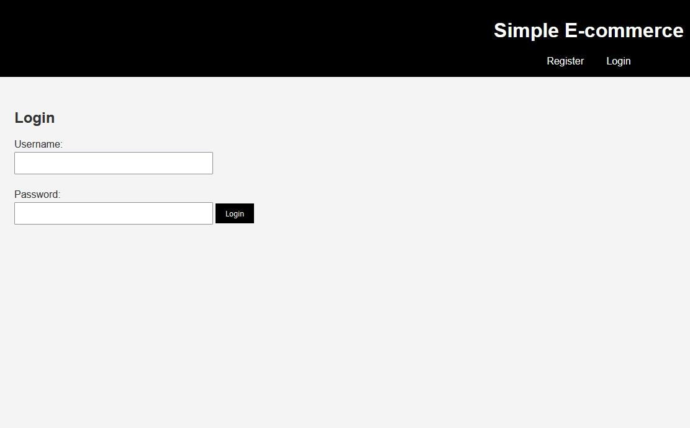
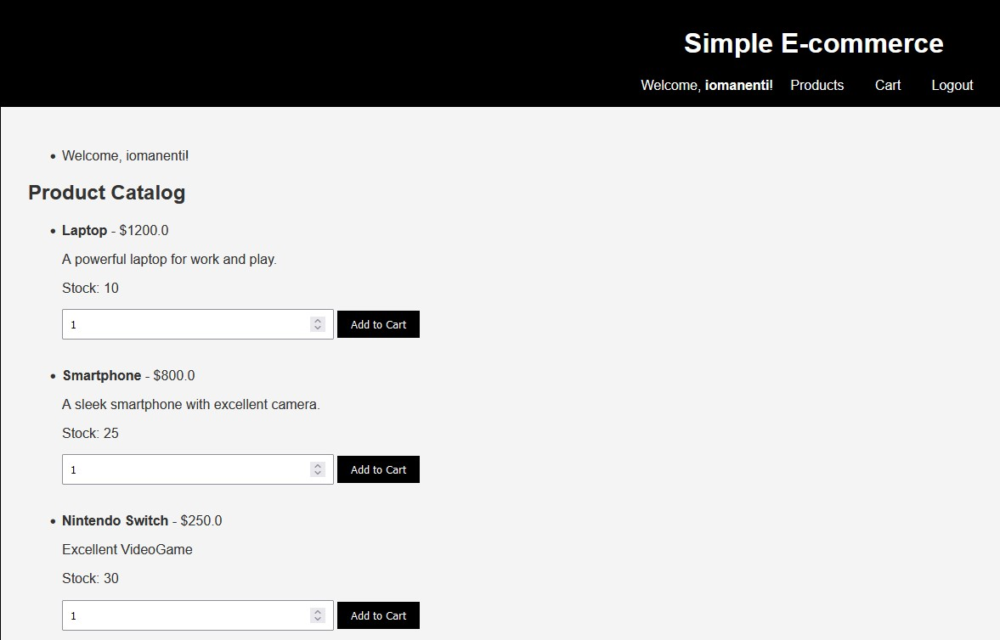

Simple E-commerce with Microservices
=====================================
<br>

The project is divided into multiple microservices, each handling specific responsibilities (e.g., user management, product management, cart, and orders). A simple frontend integrates these services.
<br>

        |-- ecommerce-microservices/

        |-- user_controller.py         # Manages user registration and authentication

        |-- product_controller.py      # Handles product addition, editing, and listing

        |-- cart_controller.py          # Manages the shopping cart functionality

        |-- order_controller.py        # Processes and records orders
    
        |-- frontend/              # Simple black and white frontend using Flask templates

        |-- tests/                # Unit testing for the vital application usage

        |-- docker-compose.yml     # For running all services

        |-- README.md

<br>

# Using Microservices Architecture on this E-commerce
Microservices architecture offers significant advantages for building scalable and maintainable applications. By dividing the application into smaller, self-contained services, it enables independent development, testing, and deployment of each component. Microservices enhance fault isolation, ensuring that a failure in one service does not impact the entire system, while also improving scalability by allowing individual services to be scaled based on demand. Overall, microservices architecture is ideal for complex systems requiring agility, scalability, and ease of maintenance.
</br>


# Unit tests on this project
</br>
The project includes basic unit tests to validate critical functionalities such as user registration, product management, and order placement. These tests are written using Python's unittest framework and simulate API requests using requests_mock. Key scenarios covered include:

    User Registration: Tests successful registration, handling of duplicate users, and invalid data.
    Product Management: Verifies product addition, updates, and error handling for invalid inputs.
    Order Placement: Confirms successful order placement and ensures proper validation of order data.

    ```python
python -m unittest discover tests

```
</br></br>


# Using the Simple E-commerce
</br>

## Login Screen
On this screen you can use to login with a registered user:
</br></br>


</br>

## Register Screen
On this screen you can register a new user and choose if it is and admin or not:
</br></br>


</br>

## Product Screen as an Regular User
Once you had logged in as a regular user you can choose the product and add to the cart with the quantity as you wanted.
</br></br>


</br>

## Product Screen as an Admin User
Once you had logged in as a admin user you can choose the product and add to the cart with the quantity as you wanted but also edit product and delete product from the catalog.
</br></br>


</br>

## Cart Screen
On this screen you can remove itens to your cart and also place your order. You cart is saved until you place an order.
</br></br>


</br>